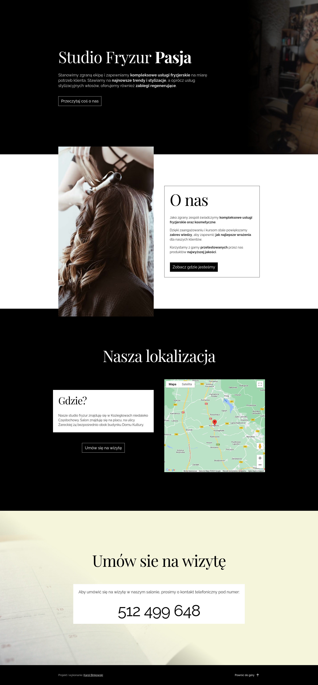

# Studio Fryzur Pasja - A local business hairdresser's website.

A dedicated website that serves as the local company's business card and aims to make the company stand out among its competitors. My services additionally included placement of the hair salon on Google maps and promotion through Google Ads.

## Demo

[studiofryzurpasja.pl](https://studiofryzurpasja.pl/)

## Screenshots



## Tech Stack

**Framework:** `Next.js`, `React`

**Design:** `Tailwind CSS`, `@tabler/icons`

**Integrations:** `Google Analytics`, `Google Maps API`

**Workflow:** `ESLint`, `TypeScript`, `Prettier`

## Features

- Google Maps map with the location of the hair salon.

## Roadmap

- Make the page footer more appealing to the user.

## Run Locally

Clone the project

```bash
  git clone https://github.com/GrzywN/pasja.git
```

Go to the project directory

```bash
  cd pasja
```

Install dependencies

```bash
  yarn install
```

Start the server

```bash
  yarn start
```
## Deployment

To deploy this project on Vercel, use the default settings for the Next.js framework.
